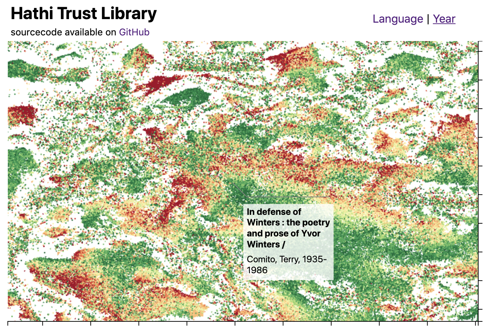
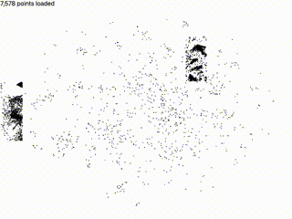

In a relatively old blog post, Colin focused on rendering very large numbers of points using D3. In this post I'll consider how you can efficiently load that data using Apache Arrow for a yank free experience.

## Background

If you've not already read [Colin's blog post](https://blog.scottlogic.com/2020/05/01/rendering-one-million-points-with-d3.html), that's a good place to start. A very short summary is that he takes a large (~600k item) dataset, streams it into the browser using a WebWorker and renders it as a point series using WebGL. Once fully loaded, the full dataset can be freely explored with minimal yank. 



However, it's fair to say that whilst loading there's a fair amount of yank. To work around this, most functionality (e.g. zooming, padding, shading) is disabled until the chart is fully loaded. In the rest of this post we'll look at one way to optimise this loading for a yank-free loading experience.

## D3, WebGL & large datasets

In the next couple of sections, I need to go pretty deep into the internals of a few different technologies. Whilst I find this interesting, I appreciate that it's not for everyone so I've decided to (literally) inject some personality into the proceedings to keep it interesting. Bear with me, I promise the whole post won't be like this!

WebGL loves a good buffer. It lives for good old fashioned Float32Arrays. Being able to let rip on those single precision floating point numbers the GPU arithmetic units crave, in a massively parallel manner no less, is what gets it up in the morning. 

The problem is, D3 datasets tend not to hang out with the hipster buffer crowd. Preferring instead to stick to the UTF-8 string encodings they grew up with. Whilst they might occasionally spice things up, for simplicity, longevity and often just the ready availability of encoders/decoders, in their eyes nothing beats good old fashioned DSV (delimiter separated format e.g. CSV, TSV) format.

In an alternative reality, eschewing buffer encoding prior to the data arriving at the browser might leave WebGL stuck. However as Colin's demo showed, in this reality the hero of our story, JavaScript, steps up to the task. Putting in an enormous effort to transform between encodings as the data streams in.

Unfortunately, our hero's actions come at the cost of significant collateral damage: heavy CPU load. At best, delivering a yank-y experience. At worst, burning through the user's battery, and lightly toasting their fingers.

The obvious solution to the problem is to perform this processing before it arrives at the browser. This would allow the data to be streamed straight through with minimal JavaScript transformation. However, the universal availability of the DSV format across the development and data ecosystems is unmatched. It would be unacceptable to lose this interoperability by implementing and maintaining a bespoke format and its encoders.

In an ideal world, there'd already be a set of data formats that are optimised for storing large datasets as WebGL-compatible buffers. Additionally, there would be a wide variety of existing well-maintained libraries available for manipulating these formats, no matter your tool or language of choice.

So I hear big data is a thing...

## Big data, D3, WebGL & large datasets

Big data/data engineering/data/whatever-it's-calling-itself-this-week loves a binary encoding format. When it's not reading an ORC file, it's re-partitioning a set of Parquet files whilst evolving an Avro schema. On occasion, it has been known to lower itself to reading in DSV or JSON files, but these are quickly transformed into more efficient representations... before anyone notices.

All of these file formats are widely supported so that should keep the D3 datasets happy and their binary encodings must surely keep WebGL happy, right? Well... no. It turns out there are multiple types of buffer hipster.

As an outsider who's done a little bit of research, my understanding is that the key theme with all of these formats is that they're designed for efficient storage and retrieval of data. They are specifically not optimised for use as a data interchange format between running services.

That is to say that they optimise for the smallest file sizes possible whilst still allowing for fast access to a particular piece of data within. Under the hood, they commonly employ tricks like run-length encoding, bit-packing, variable-length numbers and intra-file compression to help squeeze in as much data as possible. This is alongside a multitude of indices, intra/inter-file partitioning and other careful structural choices which allow data to be efficiently retrieved from these very large(-ish) and very dense files.

These highly concentrated data formats have made the big data hipsters very happy indeed. And as much as I'm poking fun at them, it is seriously impressive the volumes of data that can be interactively queried using these formats! Unfortunately, they're not going to work for us. The WebGL buffer crew need their data straight-up, byte-aligned and uncompressed... with no foam art.

That's not to say that using these formats wouldn't be the right decision in some cases. Our returning hero JavaScript would be the first to jump valiantly at any opportunity to transform some data. In fact, it may even be in a more finger-friendly/less CPU intense way than parsing DSV, but it is still processing that can be avoided in a situation where we want to minimise CPU load.

Intriguingly, deep in the heart of big data processing these formats aren't used either. When performing most compute operations on the data itself, the data is first transformed into straight-up, byte-aligned and uncompressed buffers (with no foam art). As with WebGL, this additional transformation enables more efficient parallel computation, albeit this tends to be on the CPU rather than the GPU.

Wouldn't it be great if the big data crowd got together and agreed this internal, compute-optimised format as a standard? A single format that could be used for efficient transfer of data between systems or processes, in a compute-ready format...

And what do you know? In a buffer-hipster uniting win for humanity, about 5 years ago, Apache Arrow casually strolled into town.

## Apache Arrow

Apache Arrow eschews almost all of the optimisations that drew WebGL's ire. And that's for a very good reason. Instead of being designed for efficient storage and retrieval of data, it instead [prioritises compute-ready interoperability of data between different services](https://arrow.apache.org/overview/). A format which on-receipt requires minimal, if any, transformation prior to running computationally efficient algorithms on the data. Let's dig into some of the details that make it a good fit for streaming the data into WebGL.

In DSV files, all the attributes for a single data item are stored on a single line i.e. `N` lines of `M` attributes. However, for our WebGL implementation, not only do we need this data in buffers but we also need to transpose its structure i.e. `M` buffers each containing `N` items.

Taking a few liberties which we'll address in a moment, that's exactly how Arrow arranges its data internally -

```
BUFFER 0 (the data for attribute 0)
BUFFER 1 (the data for attribute 1)
...
BUFFER N - 1 (the data for attribute N - 1)
```

Each of these buffers is guaranteed to be the same length with the values equally spaced within. That means if we wanted to read the values of all attributes in a given row, we can just index into each of these buffers in turn -

```js
const row = i => [buffer[0][i], buffer[1][i], /* ..., */ buffer[N - 1][i]];
```

Equally, to load all the data for a given attribute into WebGL we can just use the buffers directly -

```js
gl.bufferData(target[0], buffer[0], gl.ARRAY_BUFFER);
gl.bufferData(target[1], buffer[1], gl.ARRAY_BUFFER);
// ...
gl.bufferData(target[M - 1], buffer[M - 1], gl.ARRAY_BUFFER);
```

And by directly, I do mean directly. As soon as the browser receives a `RecordBatch` message, after reading some minimal metadata (e.g. offsets) and without any transformation of the data, this data is ready for loading. So what's a `RecordBatch`? 

As the name suggests, it is equivalent to a set of lines from the DSV file. There's nothing stopping you using a single batch for all the data as we were above. However, as the data in a `RecordBatch` can only be used once the full `RecordBatch` has been received, if you've got a lot of data you could be waiting a while for it to load.

In a streaming scenario, splitting the data into smaller batches means faster access to the data in the first `RecordBatch`. However, each `RecordBatch` introduces protocol overhead (i.e. more metadata for a given amount of data) and leaves us with the problem of having to reconstitute the buffers for WebGL's benefit.

Taken to its extreme, if there is only a single record per `RecordBatch`, we end up full circle. With a file somewhat equivalent to a DSV file (`92MB`), just much larger (`644MB`). More reasonable `RecordBatch` sizes (e.g. 10s per file) lead to more reasonable file sizes (roughly equivalent to the DSV file).

To quickly cover off some of the features I've glossed over, compared to DSV it also supports -

* Embedding the data schema i.e. values reliably decode to the same value they were encoded from!
* Custom complex types e.g. an attribute can itself be a list of items with their own attributes.
* Validity flags i.e. first-class support for missing/null values
* Value dictionaries i.e. efficient representation of enum values

It's worth noting that using some of these features can make the WebGL integration harder. In some cases there would be no way around transforming the data using JavaScript. However, in most cases it can be worked around with some *creative* application of WebGL features.

Enough waffle, let's build something!

## Pre-processing the data

As we're starting with an existing DSV file, we need to convert it over to Arrow format. It's a little frustrating to have to start here because one of the big selling features of Arrow is that it is already integrated with most existing tools! So typically this wouldn't be required and you'd be free to export directly from your tool of choice. However, as we've already found ourselves in an artificial situation, why not double down and make our life even more awkward, by using the raw Arrow APIs...

Firstly we need to load the tsv file using the `pyarrow` package. Counter-intuitively, that requires us to use the `csv` module configured to use a tab character as the delimiter -

```py
import pyarrow as pa
from pyarrow import csv
from pathlib import Path


source_path = Path("data.tsv")

table = csv.read_csv(
    source_path,
    parse_options=csv.ParseOptions(
        delimiter="\t",
    ),
    # ...
)

```

I believe this rather odd API is a consequence of being generated directly from the C++ bindings. Or I'm using it wrong. Either way, it only gets worse from here. I would definitely recommend avoiding the `pyarrow` package directly. 

Next up, we need to write out an Arrow format file. The specification defines two formats, a file-based format (`.arrow`) and a streaming format (`.arrows`). The file-based format contains additional metadata to allow for more efficient random access. For our use-case of streaming all of the data straight into a visualisation, this metadata is irrelevant so we'll stick with the streaming format and a `RecordBatch` size of 10,000 -


```py
target_path = Path("data.arrows")

# ...

local = fs.LocalFileSystem()

with local.open_output_stream(str(target_path)) as file:
    with pa.RecordBatchStreamWriter(file, table.schema) as writer:
        writer.write_table(table, 10000)
```

*I told you it it got worse.*

As we're converting to a schema-based format, we can take this opportunity to define the required column types for non-string columns and the sentinel values that have been used to represent `null` -

```py
# ...
    convert_options=pa.csv.ConvertOptions(
        column_types={
            "date": pa.uint32(),
            "x": pa.float32(),
            "y": pa.float32(),
            "ix": pa.uint32(),
            "language": pa.dictionary(pa.int32(), pa.utf8())
        },
        null_values=["None", ""]
# ...
```

Note there's a couple of constraints at play here: WebGL limits us to a maximum size of 32-bits for floats and Arrow limits us to a minimum of 32-bits for integers. I've also opted to encode the language string values using a dictionary as they have relatively low cardinality (unique value count) and a large default encoding (~10 character utf8 string) relative to the dictionary index (32-bit integer).

Not only have we now more easily reason about the data with an explicit schema defined, as a side-effect we've also saved a little on the file size (86MB versus 92MB). It's also worth remembering that these are uncompressed sizes and the browser will happily deal with file-level compression on our behalf. So we'd typically expect significantly less data to actually be transferred over the network (e.g. 86MB gzips to 36MB).

To improve the loading speed across the network, we can also shave a bit more from the file size by removing the unused columns, truncating the titles and unifying the dictionaries across the `RecordBatches` (saving 22MB raw, 8MB gzipped) -

```py
# remove unused columns
table = table.select(["ix", "x", "y", "title", "first_author_name", "date", "language"])

# truncate the title after 101 characters (matching display logic)
truncated_title = pc.utf8_replace_slice(table.column("title"), start=101, stop=1000, replacement="")
table = table.set_column(table.schema.get_field_index("title"), "title", truncated_title)

# ensure all dictionaries in the file use the same key/value mappings
table = table.unify_dictionaries()
```

Something I didn't realise until after I'd converted the file was quite how many *workarounds* were required to deal with poor quality data in the original demo. Specifically, [quietly dropping records with anomalous column counts](https://github.com/ColinEberhardt/d3fc-webgl-hathi-explorer/blob/master/streaming-tsv-parser.js#L27) and [filtering out non-numeric years](https://github.com/ColinEberhardt/d3fc-webgl-hathi-explorer/blob/master/index.js#L37). As we're now transforming to a schema-based format, I've moved these *workarounds* into the conversion. 

For dropping records with anomalous column counts, I couldn't find any relevant parser configuration. So instead, I just brute-forced it -

```py
temp_path = Path("data-filtered.tsv")

# ...

with open(source_path) as source:
    with open(temp_path, "w") as target:
        for source_line in source:
            if source_line.count("\t") != 8:
                # filter out records with anomalous columns
                continue
            target.write(source_line)

# ...

temp_path.unlink()
```

Filtering out rows with non-numeric years was a little easier. As I'd already explicitly set the column type to `uint32`, the parser was converting these non-numeric values to `null`. I just needed to filter the table to exclude rows where `date` was `null` -

```py
# filter out non-numeric dates (e.g. missing, "1850-1853")
mask = pc.invert(pc.is_null(table.column("date")))
table = table.filter(mask)
```

The final flourish was to sort the data by `date` to improve the loading aesthetics -

```py
# sorting by the date improves the loading aesthetics
# comment this out to exactly match the original appearance
indices = pc.sort_indices(table, sort_keys=[("date", "ascending")])
table = pc.take(table, indices)

# after sorting replace ix with an accurate row index
indices = pc.sort_indices(table, sort_keys=[("date", "ascending")])
table = table.set_column(table.schema.get_field_index("ix"), "ix", pc.cast(indices, pa.uint32()))
```

This seems to work best as the item's on-screen location is less correlated with the date than previously, but retains some level of correlation meaning the higher-concentration areas appear to grow almost organically. The original order resulted in the data loading in an almost chequerboard pattern reminiscent of the dark days of dial-up internet -




Now we have our final `.arrows` file (28MB gzipped), we can now move onto loading the data into the browser.

## Loading the Arrow data in JavaScript

Fun diversion BYOB stream reader, Rust, arrow-rust project, zero copy streaming to WebGL

turns out there's an officially supported library which consumes fetch responses. contains code to minimally join buffer network chunks into chunk (?) column data buffers

could do more copying to combine these column chunks into a mega buffer but not much to gain. 

show the load data function, explain concating tables and awaiting the open

the choice of format changes the behaviour of the reader (i.e. arrow/arrows)

## Streaming the Arrow data into WebGL

list of buffers we want to load into a given gl buffer. https://developer.mozilla.org/en-US/docs/Web/API/WebGLRenderingContext/bufferSubData

embrace the JS browser API mentality of don't sweat the small short-lived objects (gc is capable of dealing with those) but be careful with the big stuff. create a bespoke d3fc-webgl attribute that expects an array of ArrayBuffers, dirty checks the array using identity comparisons, loads new/changed data into buffer using subdata

using the arrow library technique to retrieve the list of array buffers seemed unnecessarily slow. optimised loop works like so

finally we need a custom point series to make use of the bespoke attribute. normally hidden detail of the implementation. just copy paste simplify jobby.

here it is. lost colours and annotations for now. we could restore them and shove the code in a webworker but I think we can do something more interesting if we squint at the arrow format and webgl requirements a bit more.

## Conclusion

jank free without requiring larger transfer sizes or using a web worker for transforming the data. for production obviously offscreen canvas (link to post) would have allowed the transformation to be moved off the main thread but like elon says best part is no part.


make sure we cover columnar versus rownar data